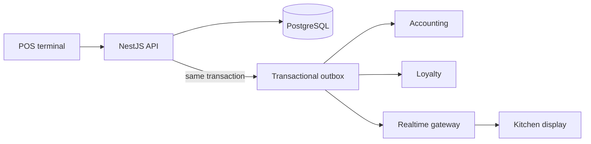

# BranchBrew ERP ☕

[](https://github.com/nkieu-config/branchbrew-cafe-erp/actions/workflows/ci.yml)
[](https://branchbrew-cafe-erp.vercel.app)


**A solo-built ERP for a multi-branch coffee-shop chain.** A sale updates inventory, loyalty, the kitchen display, and double-entry accounting from the same committed facts—so operational and financial views do not drift apart.

**Memorable result:** a k6 investigation exposed an outbox backlog that left the ledger **9m34s** behind checkout; I changed the processor and reduced measured maximum lag to **under one second** at the tested load.


<p align="center"><em>One latte, end to end: dashboard → POS checkout → kitchen display → general ledger (1.5× speed)</em></p>

## Try it in 60 seconds

1. Open the [live demo](https://branchbrew-cafe-erp.vercel.app) and choose the one-click **Manager** account. Manual login: `manager@branchbrew.dev` / `password123`.
2. In **POS → Terminal**, sell an **Iced Latte**.
3. Open **Kitchen Display** for the ticket, then **Finance → Ledger** for its balanced `ORD-*` entry.

The [guided demo](docs/demo.md) has more roles, seeded scenarios, and a 15-minute walkthrough.

> [!NOTE]
> The frontend runs on Vercel and the API on Render free tiers. A cold API may take about 30 seconds to wake, and scheduled demo resets make changes temporary.

## Why I built this

Coffee-shop operations are a useful systems problem: ingredients expire, branches share a central kitchen, and a single payment must update stock, loyalty, the kitchen, and the books without those views drifting apart. I built BranchBrew to go beyond CRUD and make those boundaries explicit. The goal was not to simulate every workflow, but to demonstrate where domain rules must meet at a reliable transaction boundary.

### What happens when you sell one latte

1. The POS creates an order in a database transaction, deducting ingredient batches first-expired-first-out (FEFO).
2. That same transaction records outbox events alongside the order; the order and its pending side effects therefore commit or roll back together.
3. Handlers post balanced journal entries, award loyalty points, and push the kitchen ticket over WebSocket.
4. The ledger may be briefly asynchronous, but it is derived from the same committed facts as operations rather than from a separate best-effort path.



## ERP breadth, not CRUD

The project deliberately spans front-of-house, operations, and finance—not a collection of isolated CRUD screens.

| POS terminal | Kitchen display |
| --- | --- |
|  |  |

| Batch inventory | General ledger |
| --- | --- |
|  |  |

Inventory tracks expiry batches and stocktakes; procurement receives and settles purchase orders; the central kitchen consumes raw batches into finished goods; HR payroll and operational events post into the same ledger. That breadth has a purpose: a purchase receipt changes both inventory value and accounts payable, a stocktake records the gap between a count and the system, and a sale turns a recipe into COGS. It made the project an exercise in shared facts across domains rather than in duplicating totals on dashboards.

The UI is responsive rather than merely scaled down. The sidebar becomes a bottom tab bar, the POS cart becomes a bottom sheet, and the kitchen board collapses into status tabs.

<details>
<summary>Responsive views — dashboard, POS, kitchen display, and orders</summary>

<table>
<tr>
<td></td>
<td></td>
<td></td>
<td></td>
</tr>
</table>

</details>

## Evidence

| Decision or guarantee | Evidence |
| --- | --- |
| A committed operation and its side effects cannot split | Orders and outbox events share one transaction; the dispatcher reclaims a dead worker's stale claim in an [e2e test](backend/test/outbox-stale-claim.e2e-spec.ts). |
| Stock cannot go negative; event redelivery cannot double-post the ledger | PostgreSQL `CHECK` constraints and unique journal references make both states unrepresentable. [Database invariants](docs/data-model.md#invariants-the-database-enforces). |
| The books stay balanced | A [real-Postgres trial-balance e2e test](backend/test/trial-balance.e2e-spec.ts) sells through the POS and asserts exact debit/credit equality. |
| Branch scope is enforced rather than remembered | `resolveBranchId` / `assertBranchAccess` centralize access decisions; an [e2e test](backend/test/finance.e2e-spec.ts) proves a cross-branch request returns 403. |
| API contracts fail in CI, not at runtime | Swagger exports the API spec, the frontend generates types from it, and [CI](.github/workflows/ci.yml) rejects drift before checks, builds, e2e, Compose smoke tests, and image scans. |
| A busy kitchen does not refetch its board per ticket | Socket.IO events patch TanStack Query via [`setQueryData`](frontend/src/hooks/useKdsSocketSync.ts). |

The [architecture deep dive](docs/architecture.md) explains the alternatives and trade-offs behind these choices.

## Performance investigation: 9m34s to under one second

**Problem.** The checkout transaction remained responsive under load, but the first k6 run showed that a 30-second rush left the ledger 9m34s behind operations.

**Diagnosis.** The old processor took one small batch every 10 seconds, capping throughput at one event per second. Event handling itself was fast; the scheduler spent nearly all of its time idle.

**Fix.** I changed it to drain batches until the queue is empty, added a re-entrancy guard for the one-second schedule, and introduced exponential retry backoff so a poison event cannot consume its attempts immediately.

**Result.** In the measured rerun, the processor kept pace with the tested arrival rate and maximum ledger lag stayed below one second. I stopped at the tested rate rather than claiming a production capacity limit; the result demonstrates the bottleneck was scheduling, not checkout work. The [architecture deep dive](docs/architecture.md#transactional-outbox) explains the trade-off against `LISTEN`/`NOTIFY`; [loadtest/README.md](loadtest/README.md) contains the reproducible k6 procedure and full measurements.

## Quick start

Docker is the shortest route; migrations and demo seed run automatically:

```bash
cp infra/.env.compose.example infra/.env.compose
npm run docker:up
```

Open [localhost:3001/login](http://localhost:3001/login). For local Node development, install Node 22, configure `backend/.env`, then run `npm run migrate`, `npm run db:seed`, `npm run dev:backend`, and `npm run dev:frontend` in separate terminals.

> [!CAUTION]
> `npm run db:seed` wipes its target database. Use a local or intentional demo database only.

## Further reading

- [Architecture](docs/architecture.md) — system shape, transactional outbox, accounting, tests, deployment, and trade-offs
- [Demo guide](docs/demo.md) — reviewer walkthrough and demo accounts
- [Data model](docs/data-model.md) — ERD and database-enforced invariants
- [Load test](loadtest/README.md) — performance harness and reproduction steps
- [Infrastructure](infra/README.md) — Docker, environment, and deployment details

## Limitations

This is a portfolio-scale system, not production-complete ERP infrastructure: one API instance, poll-based outbox delivery, standard costing rather than weighted average, whole-order refunds only, output VAT only, and no fiscal-period close. Stock quantities are still `Float`, so reconciling them against batches and migrating to `Decimal` remain roadmap work. The [architecture trade-offs](docs/architecture.md#deliberate-trade-offs) explain the reasoning and next steps.

## About

Built solo by [Natthachak (@nkieu-config)](https://github.com/nkieu-config): product design, schema, NestJS backend, Next.js frontend, automated tests, CI, and deployment.

📫 natthachak.config@gmail.com · [LinkedIn](https://www.linkedin.com/in/natthachak)

Released under the [MIT License](LICENSE).
