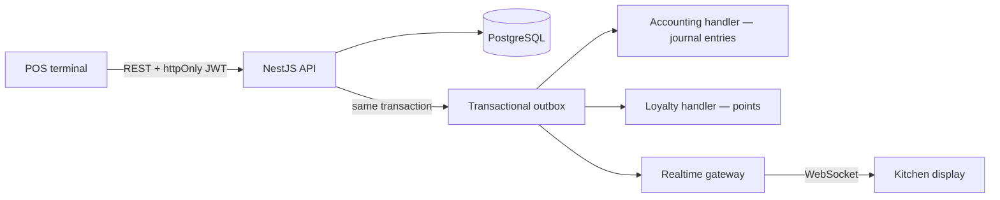

# BranchBrew ERP ☕

[](https://github.com/nkieu-config/branchbrew-cafe-erp/actions/workflows/ci.yml)
[](https://branchbrew-cafe-erp.vercel.app)
[](LICENSE)


**A full ERP for a multi-branch coffee-shop chain, built solo.** Point of sale, realtime kitchen display, batch inventory, procurement, central-kitchen production, HR and payroll, CRM loyalty: 43 app pages on a NestJS API. Every module posts into one double-entry ledger. I built both halves: the screen a barista taps, and the debit and credit lines it produces.

**23 backend modules · 131 REST endpoints · 41-table schema · 43 app pages · 464 automated tests**

**Load-tested to 150 orders/sec, ledger under a second behind.** The first k6 run left it 9 minutes behind the till. [The diagnosis, the fix, and the re-run](#performance--the-bottleneck-the-load-test-found-and-the-fix) are in this repo.


<p align="center"><em>One latte, end to end: dashboard → POS checkout → kitchen display → general ledger (1.5× speed)</em></p>

## Try it in 60 seconds

**🔗 Live demo: [branchbrew-cafe-erp.vercel.app](https://branchbrew-cafe-erp.vercel.app)**. The login page has one-click demo account buttons for Manager, Admin, and Staff. No signup, nothing to type. To sign in manually:

| Field        | Value                    |
| ------------ | ------------------------ |
| **Email**    | `manager@branchbrew.dev` |
| **Password** | `password123`            |

Then sell an Iced Latte at POS → Terminal, watch it appear on the Kitchen Display, and find its balanced journal entry under Finance → Ledger. More accounts and a 15-minute guided tour: [docs/demo.md](docs/demo.md).

> [!NOTE]
> Hosted on free tiers (frontend on Vercel, API on Render), so the first request after the API idles can take ~30s to wake. Demo data resets on a schedule, so anything you change is temporary.

Prefer to run it yourself? The whole stack comes up in two commands: see [Quick start](#quick-start).

## Why I built this

A coffee shop looks simple and is anything but. Milk expires, so stock has to be tracked in batches and used first-expired-first-out. Branches share a central kitchen that turns raw beans into cold-brew base. The Thai tax office wants a ภ.พ.30 (PP.30) VAT report. And when a barista taps Pay, five things happen at once: deduct stock, award loyalty points, fire a kitchen ticket, record the sale, post the accounting. They must never disagree with each other.

Most capstone projects stop at CRUD. I wanted to find out what it takes to keep money, stock, and realtime state consistent in one system, so I built the whole thing: from the cash-tendering keypad on the POS to the debit and credit lines it produces in the general ledger.

The rule I held myself to: **if two numbers in the system can drift apart, the design is wrong.** That one rule drove most of the architecture below.

## What happens when you sell one latte

1. The POS posts the order over REST (httpOnly-cookie JWT). The recipe deducts ingredient batches **first-expired-first-out**, with a database `CHECK` making negative stock impossible.
2. **In the same database transaction**, outbox events are written alongside the order — the order and its pending side effects commit or roll back together.
3. Outbox handlers then take over: one posts a balanced journal entry (ex-VAT revenue + output VAT liability + COGS), one awards loyalty points, one pushes the ticket to the kitchen display over WebSocket.
4. Because the same events write the ledger and move the stock, **the ledger can trail operations but never disagree with them**. The AP balance matches the unpaid-PO aging list, and the accounting P&L agrees with the dashboard to the satang. How far it trails is measured, not asserted: a median of half a second at 150 orders per second ([Performance](#performance--the-bottleneck-the-load-test-found-and-the-fix)).



**Reading the code?** Three files carry the design:

1. [`order-creation.service.ts`](backend/src/orders/order-creation.service.ts) — one transaction validates the order, deducts batches FEFO, and enqueues the outbox events.
2. [`outbox.processor.ts`](backend/src/outbox/outbox.processor.ts) — claims events, drains until empty, reclaims anything stranded by a dead worker.
3. [`accounting.service.ts`](backend/src/accounting/accounting.service.ts) — turns those events into balanced journal entries, deduped on a unique reference.

Module map, accounting event table, inventory model, auth design: [docs/architecture.md](docs/architecture.md).

## Feature tour

| Module              | What it does                                                                                                                                  |
| ------------------- | --------------------------------------------------------------------------------------------------------------------------------------------- |
| **Point of sale**   | Catalog with modifiers, member lookup, promo codes, cash tendering with change due, printable receipts, keyboard shortcuts |
| **Kitchen display** | Realtime board over WebSockets: ticket aging, all-day per-item totals, live connection badge |
| **Dashboard**       | Draggable widgets, 7/30-day revenue trend, gross margin and food-cost %, top-5 sellers, average ticket |
| **Inventory**       | Batch tracking with FEFO deduction, expiry alerts, inter-branch transfers, waste disposal, blind stocktakes that post shrinkage |
| **Procurement**     | Suppliers, purchase orders, goods receiving, low-stock auto-reorder, supplier payments that settle accounts payable                           |
| **Central kitchen** | Bills of materials and production orders that consume raw batches and produce finished-goods batches                                          |
| **HR & payroll**    | Shift scheduling, attendance, leave approvals, payroll runs that post to the ledger                                                           |
| **Finance**         | Double-entry GL posted from domain events, trial balance, P&L trend, AP aging, ภ.พ.30-style VAT report, shift settlements, CSV export         |
| **CRM & org**       | Loyalty earned and redeemed at the till, multi-branch RBAC (super admin / manager / staff), audit log, live notifications |

| POS terminal                                  | Kitchen display                         |
| --------------------------------------------- | --------------------------------------- |
|  |  |

| Batch inventory — FEFO & expiry calendar                                     | General ledger                                    |
| ---------------------------------------------------------------------------- | ------------------------------------------------- |
|  |  |

<details>
<summary>📸 More screenshots — stocktake, central kitchen, procurement, CRM, HR, dark mode</summary>

| Stocktake variance review                                 | Central kitchen production board                                      |
| --------------------------------------------------------- | --------------------------------------------------------------------- |
|  |  |

| Purchase orders                                                | CRM loyalty members                                               |
| -------------------------------------------------------------- | ----------------------------------------------------------------- |
|  |  |

| Shift scheduling                                         | Dashboard in dark mode                                    |
| -------------------------------------------------------- | --------------------------------------------------------- |
|  |  |

</details>

## Responsive by design

Every screen is built mobile-first, so the app reshapes for a phone rather than shrinking. The sidebar becomes a bottom tab bar, the POS cart slides up as a bottom sheet, the KDS two-column board collapses into a swipeable New / Cooking switch, and dense tables fold each row into a card. Tokens and form conventions: [docs/design-system.md](docs/design-system.md).

<table>
<tr>
<td></td>
<td></td>
<td></td>
<td></td>
</tr>
</table>

## Engineering decisions I'd defend in an interview

- **Transactional outbox over direct side effects** — business writes commit together with their events in one transaction, so accounting, loyalty, and realtime updates can be delayed but never lost or desynced.
- **Money is never a float** — all financial math runs on `Prisma.Decimal` with explicit rounding; journal entries must balance to the cent before they persist.
- **The API contract is a build artifact** — the backend exports `openapi.json`, the frontend generates its client types from it, shared enums generate from the Prisma schema, and CI fails on any drift. A breaking backend change is a red pipeline, not a runtime surprise.
- **JWT with real revocation** — httpOnly cookie plus a per-user token version. Logout bumps it, and so does any admin change to a user's branch, role, or password, so a demoted or compromised account loses its live tokens immediately rather than at expiry.
- **One authorization primitive** — branch-owned data resolves through a shared branch-scope helper rather than per-endpoint discipline, and an e2e test proves a cross-branch write returns 403. `Customer` is chain-level and has no branch, so loyalty lookups are the one unscoped surface. I document that gap rather than hide it.
- **Standard costing with variance accounts** — inventory is carried at standard cost, and the gap against actual posts to its own GL account on both sides: production to 5030, purchase receipts to 5035. Without that, price differences pile up in the inventory account forever.
- **The kitchen board never refetches** — WebSocket events patch the TanStack Query cache directly (`setQueryData`) instead of invalidating it, so a busy kitchen doesn't re-download the board on every ticket. Marking a ticket done is optimistic: cancel in-flight queries, snapshot the cache, apply the change, roll back on rejection.
- **The server decides who sees an app shell** — auth gating runs in the App Router server layout, so an unauthenticated visitor never renders a page frame and then flickers back to login. The session is read once per request and cached.

Each of these is expanded with the reasoning and trade-offs in [docs/architecture.md](docs/architecture.md).

## Tech stack

| Layer      | Stack                                                                             | Why                                                                                                                                                |
| ---------- | --------------------------------------------------------------------------------- | -------------------------------------------------------------------------------------------------------------------------------------------------- |
| Frontend   | Next.js 16 (App Router), React 19, TanStack Query 5, Ant Design 6, Tailwind CSS 4 | Server layouts gate auth before a shell renders, and TanStack Query gives the WebSocket a cache to patch instead of a refetch to fire              |
| Backend    | NestJS 11, Prisma 7, PostgreSQL, Passport JWT, socket.io                          | DI and module boundaries keep 23 domains from collapsing into one service; one Postgres lets a business write and its outbox event commit together |
| Testing    | Jest, Vitest, Playwright (with axe accessibility checks), supertest               | Unit tests for money math and validators; e2e against a real Postgres for the claims only concurrency can break                                    |
| Infra & CI | Docker multi-stage builds, Docker Compose, GitHub Actions, Trivy image scanning   | One command brings up the whole stack, and CI runs the same Compose file it ships                                                                  |

## Quick start

**Docker (recommended)** — migrations and demo seed run automatically:

```bash
cp infra/.env.compose.example infra/.env.compose
npm run docker:up
```

Open [localhost:3001/login](http://localhost:3001/login) and sign in with the demo account above.

**Local Node** (Node 22, a running Postgres):

```bash
npm install
cp backend/.env.example backend/.env   # set DATABASE_URL, JWT_SECRET
npm run migrate
npm run db:seed                        # demo data
npm run dev:backend                    # API on :3000
npm run dev:frontend                   # UI on :3001
```

> [!CAUTION]
> `npm run db:seed` wipes the target database before loading demo data. Never point it at anything you care about.

Production modes, TLS on a VPS, and the env matrix: [infra/README.md](infra/README.md).

## API

All 131 endpoints are documented with Swagger at [localhost:3000/docs](http://localhost:3000/docs) once the stack is up. Those schemas are the same ones the frontend generates its client types from: `npm run openapi:export` writes the `openapi.json` that CI drift-checks. The route is mounted only outside production, so the live demo doesn't serve it.

Auth is an httpOnly cookie, so a session is two calls. Sign in, then reuse the cookie jar:

```bash
curl -s -c jar.txt -X POST http://localhost:3000/auth/login \
  -H 'Content-Type: application/json' \
  -d '{"email":"manager@branchbrew.dev","password":"password123"}'
```

```bash
curl -s -b jar.txt http://localhost:3000/orders          # scoped to the caller's branch
curl -s -b jar.txt http://localhost:3000/orders/kds      # the kitchen display queue
```

Login is throttled to 5 attempts per minute. Staff and managers are pinned to their own branch, and asking for another one returns 403 rather than someone else's orders. Only a super admin may pass a `branchId` across branches.

## Testing & quality

464 tests across four suites — backend unit (241, Jest), backend e2e against a real Postgres (30, supertest), frontend unit (177, Vitest), and frontend e2e (16, Playwright with axe accessibility smoke).

CI runs type-checks, lint, coverage thresholds, all four suites, a Docker Compose smoke test of the full stack, Trivy image scans, and drift checks on every generated artifact. What each suite proves and why: [docs/architecture.md](docs/architecture.md#testing-strategy).

```bash
npm test                    # unit suites
npm run test:e2e:backend
npm run test:e2e:frontend
```

## Performance — the bottleneck the load test found, and the fix

I load-tested the checkout path with [k6](loadtest/) instead of guessing, and it caught a bottleneck no unit test could have. Measured on an Apple M4 (10 cores, 16 GB) with the API and PostgreSQL 16 in Docker Compose, ordering a real product so every request runs a full FEFO deduction.

The synchronous write held up. At 150 orders/sec the transaction that deducts batches, guards stock, writes the order, and enqueues the outbox event kept a p95 of 42 ms and dropped no requests in any run.

The outbox processor did not. It polled every 10 seconds for a batch of 10 events, a ceiling of one event per second, and the test measured exactly that. A 30-second rush of 601 orders left the ledger **9 minutes 34 seconds** behind operations. Nothing was lost or wrong, but "trails by a moment" was not true. Applying an event costs a median of 2 ms, so the processor sat idle 99.7% of the time. The fix was in the processor, not the database: drain until the queue is empty instead of one batch per tick, and poll every second.

| Load                       | Duration | Checkout p95 | Accepted  | Outbox drain rate | Ledger lag p50 | Ledger lag max |
| -------------------------- | -------- | ------------ | --------- | ----------------- | -------------- | -------------- |
| 20 orders/sec — **before** | 30s      | 18 ms        | 601/601   | 1.00 events/sec   | 4 min 49s      | 9 min 34s      |
| 20 orders/sec — **after**  | 30s      | 18 ms        | 601/601   | 19.4 events/sec   | **0.5s**       | **1.0s**       |
| 50 orders/sec — after      | 20s      | 12 ms        | 1000/1000 | 48.8 events/sec   | 0.5s           | 1.0s           |
| 150 orders/sec — after     | 10s      | 42 ms        | 1501/1501 | 148.7 events/sec  | 0.5s           | 0.9s           |

The drain rate now tracks the arrival rate, so lag is bounded by the one-second poll instead of a backlog that grows with the rush. Same guarantees at 150× the drain rate, no change to checkout latency. 150 orders/sec is where I stopped testing, not where it broke. Why polling rather than `LISTEN`/`NOTIFY`, and the retry backoff a faster tick made necessary: [docs/architecture.md](docs/architecture.md#transactional-outbox).

> [!NOTE]
> The deployed API throttles to 60 requests/min per IP, so these rates need the limit lifted — the load-test Compose override does exactly that. Reproduce with `npm run docker:up:loadtest && npm run loadtest:stock && RATE=20 DURATION=30s npm run loadtest`; details in [loadtest/README.md](loadtest/README.md).

## CI/CD

A commit reaches the live demo in minutes, with no manual deploy step:

- **Before every push.** A husky pre-push hook runs the local gate: type-check, lint, and both unit suites (418 tests). The e2e suites need a database and a running stack, so they are CI's job.
- **On push to `main`.** [CI](.github/workflows/ci.yml) runs the four suites, a Compose smoke test, Trivy scans, and drift checks. In parallel, Vercel rebuilds the frontend and Render rebuilds the API image.
- **Every 3 hours.** [A scheduled workflow](.github/workflows/refresh-demo.yml) reseeds the demo database, so the dashboard and kitchen display show live data instead of a stale snapshot.

Topology and trade-offs, including why the deploys aren't gated on CI and what that costs: [docs/architecture.md](docs/architecture.md#deployment).

## Documentation

| Doc                                            | What's inside                                                                           |
| ---------------------------------------------- | --------------------------------------------------------------------------------------- |
| [docs/architecture.md](docs/architecture.md)   | Deep dive — outbox, accounting event map, inventory model, auth, deployment, trade-offs |
| [docs/demo.md](docs/demo.md)                   | 15-minute guided demo, all demo accounts, interview talking points                      |
| [docs/privacy.md](docs/privacy.md)             | PDPA data inventory, who can see member data, and the erasure path                     |
| [docs/data-model.md](docs/data-model.md)       | Core ERD, database-enforced invariants, domain map of all 41 tables                     |
| [docs/design-system.md](docs/design-system.md) | Design tokens, form patterns, UI conventions                                            |
| [loadtest/README.md](loadtest/README.md)       | k6 checkout load test, the outbox-lag reporter, and how to reproduce the numbers above  |
| [infra/README.md](infra/README.md)             | Docker stacks, env matrix, production modes, TLS on a VPS                               |
| [backend/README.md](backend/README.md)         | API setup, architecture highlights, test commands                                       |
| [frontend/README.md](frontend/README.md)       | UI setup, generated API types, test commands                                            |

## Limitations

Scope I cut on purpose, with the reasoning in [docs/architecture.md](docs/architecture.md#deliberate-trade-offs):

- The outbox is still poll-based, so the ledger lags operations by up to a second by design (measured p50 0.5s); pushing that to milliseconds means `LISTEN`/`NOTIFY`, which I judged not worth the complexity
- No account lockout (demo credentials are public; login is IP-throttled instead)
- Standard costing — no weighted-average recalculation on purchase receipts
- Whole-order refunds only (no partial refunds)
- Output VAT only — input VAT on purchases isn't tracked
- Consent is implied by registration rather than recorded, and reads of personal data are not audited — [docs/privacy.md](docs/privacy.md) has the data inventory, the erasure path, and why tax invoices survive it

Next on the roadmap: pagination on the remaining list endpoints (`/orders` is bounded and paginated; customers, settlements and audit logs are not yet), end-to-end `Decimal` stock quantities, outbox dead-letter queue with replay, and scheduled stock reconciliation.

## What building this taught me

The hard part was the seams between modules, not the CRUD. My first version announced a sale with an in-process event emitter fired from inside the transaction: the order committed, then the accounting and loyalty listeners ran on a best-effort basis. If one threw, or the process restarted at the wrong moment, the sale was real and its journal entry silently never existed. Replacing that with the transactional outbox is the change I'd point to first. Consistency is something you design in from the start, not something you bolt on after the numbers already disagree.

The second lesson was to stop trusting myself to remember things. A `CHECK` constraint makes negative stock unrepresentable; a CI job that fails on API-contract drift turns a breaking change into a red pipeline. Both catch mistakes that "just be careful" never will.

## About

Built solo by [Natthachak (@nkieu-config)](https://github.com/nkieu-config) as a software-engineering capstone project: design, schema, backend, frontend, tests, CI, and deployment.

📫 natthachak.config@gmail.com · [LinkedIn](https://www.linkedin.com/in/natthachak)

> [!IMPORTANT]
> © 2026 Natthachak Jeungraksareechai — all rights reserved. This code is public so you can read it as a work sample; it is **not** licensed for reuse. Please don't copy it or submit it as your own. See [LICENSE](LICENSE).
