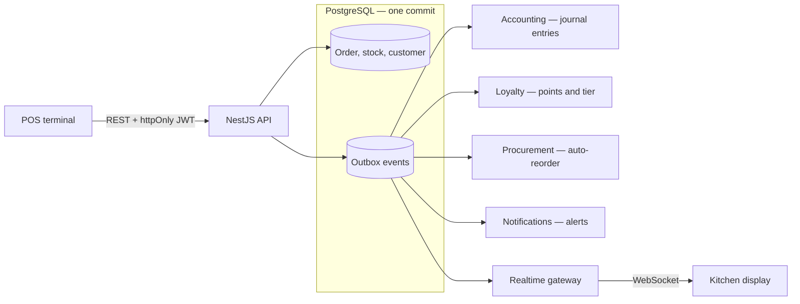

# BranchBrew ERP

[](https://github.com/nkieu-config/branchbrew-cafe-erp/actions/workflows/ci.yml)


**A multi-branch coffee-shop ERP, built solo.** One checkout has to move stock, loyalty, the kitchen display, and the accounting ledger at once, so any side effect that fails quietly leaves the books disagreeing with operations. A transactional outbox writes the order and its side effects in the same commit, so they cannot split.

**Live demo:** https://branchbrew-cafe-erp.vercel.app

## Screenshots

<p align="center">
  
</p>

<p align="center"><em>One latte, end to end: dashboard → POS checkout → kitchen display → general ledger (1.5× speed).</em></p>

<p align="center">
  
</p>

<p align="center"><em>POS terminal — modifiers priced into the cart before the order is committed.</em></p>

<p align="center">
  
</p>

<p align="center"><em>The same sale in the general ledger — posted by a handler, never typed by a human.</em></p>

<table>
  <tr>
    <td width="50%" valign="middle"></td>
    <td width="50%" valign="middle"></td>
  </tr>
  <tr>
    <td align="center"><em>Ingredients are held as batches — a sale deducts the one that expires first.</em></td>
    <td align="center"><em>Receipt and payment are tracked apart, so a received unpaid order stays an open payable.</em></td>
  </tr>
</table>

<p align="center">
  
</p>

<p align="center"><em>Kitchen display — pushed over WebSocket, not polled.</em></p>

<p align="center">
  
  &nbsp;&nbsp;&nbsp;
  
</p>

<p align="center"><em>The same two screens on a phone — one layout, not a separate mobile build.</em></p>

## Try it in 60 seconds

1. Open the [live demo](https://branchbrew-cafe-erp.vercel.app) and select the one-click **Manager** account — or sign in as `manager@branchbrew.dev` / `password123`.
2. In **POS → Terminal**, sell an **Iced Latte**, then watch the ticket reach **Kitchen Display** without a reload.
3. Open **Finance → Ledger** and find the balanced `ORD-*` entry that same sale just posted.

> [!NOTE]
> Free-tier hosting: the first API request after inactivity can take about 30 seconds, and the demo data resets on a schedule.

More roles, seeded scenarios, and a 15-minute walkthrough are in the [demo guide](docs/demo.md).

## How it works



- **An order and its side effects commit together.** One transaction validates the order, deducts ingredient batches first-expired-first-out, and enqueues the outbox events every downstream handler runs on. [Transactional outbox](docs/architecture.md#transactional-outbox).
- **The ledger is derived, not duplicated.** Handlers post balanced journal entries from the same committed facts as operations, deduping on a unique reference so at-least-once delivery cannot double-post. [Accounting](docs/architecture.md#event-driven-double-entry-accounting).
- **Branch scope is enforced, not remembered.** `resolveBranchId` and `assertBranchAccess` centralize every access decision, so no handler is trusted to remember the check. [Security model](docs/architecture.md#authentication-and-authorization).
- **The kitchen board patches, it never refetches.** Socket.IO events update the TanStack Query cache in place, so a busy service does not refetch the whole board per ticket. [Frontend](docs/architecture.md#frontend-architecture).

## Project structure

The diagram above is the runtime path. This is the source tree, which is a different question: not what calls what at run time, but what `import`s what at build time.

Twenty-three feature modules, sliced by business domain rather than by technical role. Each repeats one shape, so the layer a file belongs to is legible from its path:

```text
backend/src/orders/           23 modules, this shape
  orders.controller.ts          HTTP in, HTTP out — never touches the ORM
  dto/                          request validation and the documented response shape
  order-creation.service.ts     the use case — load, decide, write, enqueue
  domain/                       business rules, no framework imports
  helpers/                      the parts that genuinely speak Prisma.TransactionClient
  events/                       what this module announces to everyone else

frontend/src/
  app/ components/              routes and presentation
  hooks/domains/ lib/api/       one hook set per backend domain; the only place fetch is called
  types/                        the API contract, generated from the exported OpenAPI spec
```

**`domain/` is a promise the linter keeps.** ESLint refuses any import of `@prisma/client` or `@nestjs/*` inside those 15 files, so the rules that gate a refund, explode a recipe, and decide an account’s normal balance stay portable — and the boundary fails in CI rather than in review. The 9 files left in `helpers/` are the ones that take a `Prisma.TransactionClient`; sorting by "does this touch the database" is the whole distinction.

Below that line, services still query Prisma directly rather than through a repository interface — a deliberate trade at one service and one Postgres. [Layers and the Dependency Rule](docs/architecture.md#layers-and-the-dependency-rule) has the full edge-by-edge table, including the one leak the lint rule does not catch.

## Evidence

| Guarantee | Proof |
| --- | --- |
| A committed operation and its side effects cannot split | Orders and outbox events share one transaction, and [a dead worker's stale claim](backend/test/outbox-stale-claim.e2e-spec.ts) is reclaimed by the next dispatcher rather than stranding the event. |
| Stock cannot go negative and redelivery cannot double-post | PostgreSQL `CHECK` constraints and unique journal references make both states impossible to store, not merely unlikely. [Database invariants](docs/data-model.md#invariants-the-database-enforces). |
| The books stay balanced | [A real-Postgres trial balance](backend/test/trial-balance.e2e-spec.ts) sells through the POS and asserts exact debit and credit equality. |
| Branch data cannot leak across branches | [A cross-branch request](backend/test/finance.e2e-spec.ts) returns 403, and the access decision lives in one utility rather than in each handler. |
| API contracts fail in CI, not at runtime | Swagger exports the spec, the frontend generates its types from it, and [CI](.github/workflows/ci.yml) rejects any drift before tests run. |
| The ledger keeps pace with the till | A 30-second rush at 20 orders/s once left it **9m34s** behind; a drain-until-empty processor cut measured maximum lag to **under one second**, tracking arrival rate up to the 150 orders/s tested. [Method and reproduction](loadtest/README.md). |

The [architecture deep dive](docs/architecture.md) covers the alternatives considered and the trade-off behind each choice.

## Tech stack

| Layer | Stack |
| --- | --- |
| **Frontend** | Next.js 16 (App Router), React 19, TanStack Query, Tailwind CSS v4 |
| **Backend** | NestJS 11, Prisma 7, Socket.IO, transactional outbox |
| **Data** | PostgreSQL — `CHECK` constraints, unique journal references, `Decimal` money |
| **Contracts** | Swagger/OpenAPI export, generated frontend types, a shared types workspace |
| **Quality & delivery** | Jest, Vitest, Playwright, k6, Docker, GitHub Actions, Trivy |

## Run it locally

Requires Docker, or Node 22 with your own PostgreSQL.

```bash
cp infra/.env.compose.example infra/.env.compose
npm run docker:up
```

The web app starts at http://localhost:3001/login, the API at http://localhost:3000, and local Swagger at http://localhost:3000/docs. Migrations and the demo seed run automatically. Running against your own Postgres is covered in the [demo guide](docs/demo.md#quick-start).

> [!CAUTION]
> `npm run db:seed` wipes its target database. Use a local or intentional demo database only.

## Documentation

- [Architecture](docs/architecture.md) — boundaries, the transactional outbox, and the alternatives rejected on the way here.
- [Data model](docs/data-model.md) — the ERD and the invariants the database itself enforces.
- [Demo guide](docs/demo.md) — a reviewer walkthrough, demo accounts, and the seeded edge cases worth breaking.
- [Load test](loadtest/README.md) — the k6 harness that found the outbox bottleneck, and how to reproduce it.
- [Infrastructure](infra/README.md) — Docker, environment files, and deployment.

## Limitations

- Portfolio-scale infrastructure: one API instance and poll-based outbox delivery rather than `LISTEN`/`NOTIFY`.
- Standard costing rather than weighted average, whole-order refunds only, and output VAT only.
- No fiscal periods and no period close — the largest single gap against a production ERP.
- Stock quantities are still `Float`; moving them to `Decimal` and reconciling against batches is roadmap work.

The reasoning and next steps for each are in [deliberate trade-offs](docs/architecture.md#deliberate-trade-offs).

## License

MIT — see [LICENSE](LICENSE).
